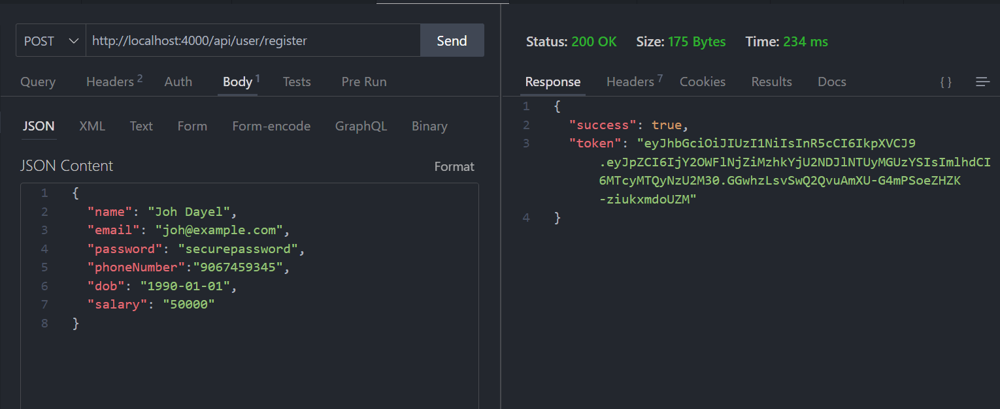

## Money Lending Application(Backend)


### Overview
This project implements the backend for a money lending application, similar to apps like Slice and KreditBee. The backend is developed using MongoDB, Postman, and Node.js.
The following 4 APIs are implemented.

### APIs

#### 1. Register API
- **Endpoint:** POST /register
- **Functionality:**
  - Approve or reject the application based on user age and monthly salary.
  - Register the user after all verification.
  

- **Validation Criteria:**
  - User should be above 20 years of age.
  
  - Monthly salary should be 25k or more.
  


#### 2. Login API
- **Endpoint:** POST /login
- **Functionality:**
  - Allow user to login using email and password.
  - Use JWT for authentication.
  

#### 3. Show User Data
- **Endpoint:** GET /get
- **Functionality:**
  - Show user data with the following fields:
    - Purchase Power amount
    - Phone number
    - Email
    - Date of user registration
    - DOB
    - Monthly salary
  

#### 4. Borrow Money API
- **Endpoint:** POST /borrow
- **Functionality:**
  - Allow the user to borrow money from the application.
  - Update the Purchase Power amount.
  - Calculate the tenure of repayments and the monthly repayments with an interest rate of 8%.
  - Return the updated Purchase Power amount and the monthly repayment amount.
  


## API Details

### User Route: `/api/user`
### Regiter API
**Endpoint:** `/register`  
**Method:** `POST`  
**Body:**
```json
{
  "name": "Joh Dayel",
  "email": "joh@example.com",
  "password": "securepassword",
  "phoneNumber":"9067459345",
  "dob": "1990-01-01",
  "salary": "50000"
}
```
**Response:**
```json
{
  "success": true,
  "token": "<token generated>"
}
```
### Login API
**Endpoint:** `/login`  
**Method:** `POST`  
**Body:**
```json
{
  "email": "joh@example.com",
  "password": "securepassword"
}
```
**Response:**
```json
{
  "success": true,
  "token": "<JWT token>"
}
```
### Get User API
**Endpoint:** `/get`  
**Method:** `GET`  
**Body:**
```json
{
  "email": "joh@example.com"
}
```
**Response:**
```json
{
 "success": true,
  "userData": {
    "purchasePowerAmount": 1200000,
    "phoneNumber": "9067459345",
    "email": "joh@example.com",
    "registrationDate": "2024-07-19T22:19:23.238Z",
    "dob": "1990-01-01",
    "salary": 50000
  }
}
```


### Loan Route: `/api/loan`
### Borrow API
**Endpoint:** `/borrow`  
**Method:** `POST` 
**Header:**
```json
{
  "token":"<token received on login/register>"
}
```
**Body:**
```json
{
  "borrowedAmount":"13000"
}
```
**Response:**
```json
{
  "success": true,
  "data": {
    "loan": {
      "userId": "669ae66b38db5642e5520e3a",
      "borrowedAmount": 13000,
      "monthlypayment": 263.5931257493801,
      "tenure": "60 months",
      "_id": "669ae73438db5642e5520e45",
      "__v": 0
    },
    "updatedPurchasingPower": 1187000
  }
}
```

### Setup Instructions

1. **Clone the repository:**
```bash
   git clone https://github.com/AmanM137/Money-Lending-Application-Backend.git
```
2. **Navigate to the project directory:**
```bash
   cd backend
```
3. **Install dependencies:**
```bash
    npm install
```
4. **Set up environment variables:**
```bash
    PORT=<your-port>
    MONGO_URI=<your-mongodb-uri>
    JWT_SECRET=<your-jwt-secret>
```
5. **Start the server:**
```bash
    npm run server
```
6. **Use Postman to test the APIs.**
